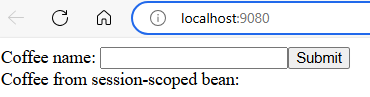
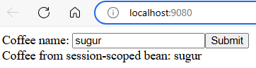

# Using Redis as session cache for Open Liberty

Open Liberty provide a session cache feature that enables you to store HTTP session data in an external cache. 
In this quickstart, you use the [JCache Session Persistence](https://openliberty.io/docs/latest/reference/feature/sessionCache-1.0.html) feature to store the session data in the Redis cache. 
The sample app used in this quickstart is a simple JavaServer Faces (JSF) application that uses a session scoped bean to store the name of a coffee.

## Prerequisites

- Prepare a local machine with Unix-like operating system and browser installed.
- Install [Git](https://git-scm.com/downloads).
- Install a Java Standard Edition (SE) implementation version 17 or later.
- Install [Maven](https://maven.apache.org/download.cgi) 3.9.8 or higher.
- Install [Docker](https://www.docker.com/products/docker-desktop).

## Setting up the Redis cache using Docker

First, specify a password for the Redis cache:

```bash
REDIS_PASSWORD=<your-redis-password>
```

Next, run the following command to start a Redis container with the specified password:

```bash
docker run --name redis -d -p 6379:6379 redis redis-server --requirepass "$REDIS_PASSWORD"
```

Then, export the following environment variables that are used by the application to connect to the Redis cache:

```bash
export REDIS_CACHE_ADDRESS=redis://localhost:6379
export REDIS_CACHE_KEY="$REDIS_PASSWORD"
```

## Running the application

First, clone the repository to your local machine and check out the sample code:

```bash
git clone https://github.com/majguo/open-liberty-on-aks-fork.git
cd open-liberty-on-aks-fork
git checkout session-scoped
cd java-app-jcache
```

Next, build and run the application:

```bash
mvn clean package
mvn -Predisson validate
mvn dependency:copy-dependencies -f pom-redisson.xml -DoutputDirectory=target/liberty/wlp/usr/shared/resources
mvn liberty:dev
```

Once the application is startd and running, open a tab in the browser and navigate to `http://localhost:9080`. The application displays a simple web page where you can set and get name for the coffee:



## Testing the session cache

To test the properties of the session scoped bean are stored in the session, open a new tab in the same browser and navigate to `http://localhost:9080`. Set a name for the coffee and click **Submit**. 
Then, navigate back to the first tab and refresh the page. The name you set in the second tab should be displayed:



To test the session data is persisted in the Redis cache, stop the application by pressing `Ctrl+C` in the terminal. Then, start the application again:

```bash
mvn liberty:dev
```

Once the application is restarted and running, open a new tab in the same browser and navigate to `http://localhost:9080`. 
The name you set in the previous session should be retrieved back from the Redis cache and still be displayed. However, it's observed that the name is not displayed:


This may be an issue with Open Liberty's JCache session persistence feature when using `SessionScoped` CDI beans.
